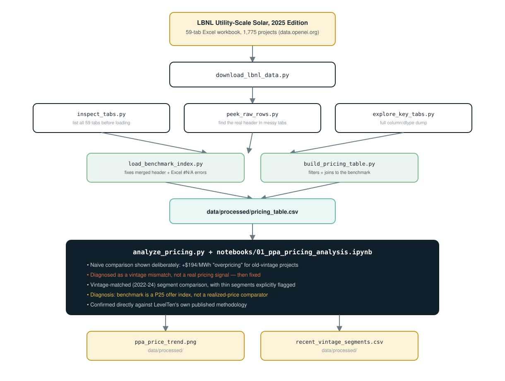
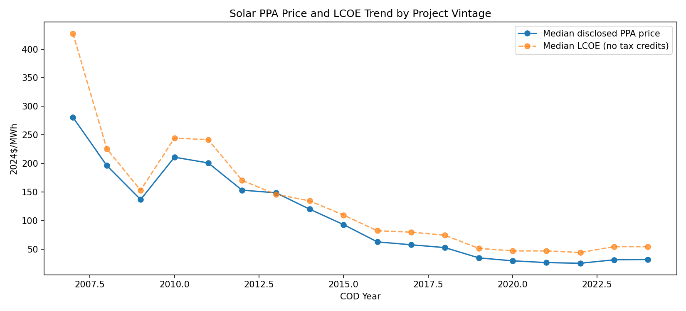

[README.md](https://github.com/user-attachments/files/32712818/README.md)
# Solar PPA Pricing & Discounting Analysis

**One-line hook:**
> Realized 2022–2024 solar PPA prices came in $11–33/MWh below the LevelTen/Trio market index —
> but that gap turned out to be a methodology artifact (a signed deal price compared against a
> developer *offer* index), not evidence these deals were priced better than the market.

## Introduction

Is a given solar power purchase agreement (PPA) priced well relative to the market — and can a
public market-price index actually answer that question? There's no public dataset of real
negotiated deals with win/loss outcomes, so this project uses a strong analog: LBNL's
utility-scale solar PPA database, benchmarked against a third-party market-price index, the same
kind of check a commercial pricing desk runs before signing off on a deal. Along the way, a real
methodology mistake got caught and fixed rather than shipped — that turned out to be more
valuable than the original benchmark question itself.

## Architecture



## Technology Used

- **Python** — extraction, cleaning, and analysis
- **Pandas** — filtering, joins, and segment-level aggregation
- **openpyxl** — reading a 59-tab, 54 MB Excel workbook directly, including tabs with merged
  headers and literal Excel formula-error strings that needed explicit cleaning
- **Matplotlib** — the vintage price-trend chart
- **Jupyter Notebook** — the consolidated, reproducible analysis

## Dataset Used

| Source | What | Frequency | Notes |
|---|---|---|---|
| **LBNL Utility-Scale Solar, 2025 Edition** (`data.openei.org/submissions/8541`) | PPA prices, CapEx, LCOE, capacity factors, by project/region/technology/vintage | Annual, 1,775 projects through 2024 | Genuinely structured, not prose — CC BY 4.0 licensed. 54.31 MB — not committed to git, downloaded locally instead. |
| **LevelTen & Trio 2024 PPA Index** (same workbook) | Regional market-price benchmark, 7 organized ISO/RTO markets | Annual (2024) | Confirmed directly against LevelTen's own published methodology: a **P25 index of developer-submitted offer prices**, not realized deal prices — the central finding of this project. |

Only **24% of PV projects (425 of 1,759)** disclose a PPA price at all — utility self-build
projects typically don't have an arm's-length PPA. Every finding below describes that disclosed
subset specifically, not the full market.

## Results



- **~85% decline** in median disclosed PPA price from 2010–11 vintage (~$200/MWh) to 2022–24
  vintage (~$25–32/MWh), tracking LCOE closely — independently reproducing LBNL's own published
  industry trend.
- **A mistake caught before it shipped**: a naive same-year benchmark comparison across all
  vintages showed +$194/MWh "overpricing" for 2011-vintage projects — an artifact of comparing
  prices 14 years and an 85% industry decline apart, not a real signal.
- **Every reliably-sized, vintage-matched segment still showed a $11–33/MWh gap below
  benchmark** — traced to a benchmark-methodology mismatch (asking price vs. realized price),
  confirmed against the index provider's own documentation, not a pricing-skill finding.
- Full reproducible analysis: [`notebooks/01_ppa_pricing_analysis.ipynb`](notebooks/01_ppa_pricing_analysis.ipynb)

---

## Business context
You're acting as a Pricing Analyst supporting a commercial/deal-pricing team (modeled on real
JDs: analyze deal data and market benchmarks, identify pricing trends and win/loss drivers,
prepare pricing analysis for executive consumption).

## Methodology
- Filtered the 1,775-project master table to `Solar Tech Main == 'PV'` (excludes CSP) and to
  rows with a disclosed PPA price.
- Cleaned the benchmark tab: a two-row merged header (found by inspecting raw rows directly)
  and literal Excel formula-error strings (`#N/A`, `#DIV/0!`) converted to proper `NaN`.
- **First pass, shown deliberately rather than hidden:** joined all 425 disclosed-price
  projects (vintage 2007–2024) against the single 2024 benchmark. Produced apparent
  "overpricing" of +$194/MWh for 2011-vintage projects — traced to the vintage gap, not a real
  pricing signal. Fixed by restricting the benchmark comparison to matching-vintage
  (2022–2024) projects, and treating the full range as a separate trend analysis instead.
- Segment comparisons explicitly flag groups with fewer than 5 projects as unreliable, and
  separately flag regions where the benchmark itself is unavailable, rather than conflating
  the two.

## Key findings
1. **PPA prices fell dramatically by vintage, tracking LCOE closely** — see Results above.
2. **Only 24% of PV projects disclose a PPA price** (425 of 1,759) — a real selection-bias
   constraint on this whole analysis, stated explicitly rather than implied.
3. **A naive same-year benchmark comparison across all vintages produces a misleading result**
   — documented as a methodology fix, not hidden as if the corrected analysis were the only
   one ever run.
4. **Even after restricting to matching-vintage (2022–2024) projects, every reliably-sized
   segment priced $11–33/MWh below the LevelTen/Trio benchmark** — CAISO (−$18, n=21), MISO
   (−$14, n=13), PJM (−$29, n=15) by region; Corporate (−$33, n=8), Investor-owned Utility
   (−$11, n=11), Monopoly IOU (−$16, n=5), and Public Utilities (−$23, n=19) by offtaker type.
   The consistency across every single segment — not scattered around zero — is itself the
   signal that something structural, not deal-specific, was driving the gap.
5. **The diagnosis: this is a benchmark-methodology artifact, not a pricing finding.**
   Confirmed directly against LevelTen's own published methodology: their index is built from
   developer-*submitted offer* prices (the P25 — the more aggressive end of the offer
   distribution) for projects still under development and seeking a buyer. LBNL's data is
   realized, signed prices for completed projects. An asking price and a closing price are
   structurally different measurements.

## Recommendation
- **Don't use a third-party offer/asking-price index as a direct realized-price benchmark
  without adjustment.** Request a percentile- and stage-matched comparator, or build an
  internal realized-deal benchmark from same-vintage, same-region completed projects instead.
- **Always vintage-match two PPA price series before comparing them.** This project only
  avoided publishing a materially wrong headline finding because vintage was checked
  explicitly as a diagnostic step.
- **State the disclosure rate up front in any summary.** With only 24% of projects disclosing
  a price, say so explicitly rather than letting a reader assume full market coverage.

## Limitations & assumptions
- CSP plants excluded (16 of 1,775 projects) — PPA structure isn't directly comparable to PV.
- 184 of 425 disclosed-price projects (43%) are in regions with no matching third-party
  benchmark at all (`West (non-ISO)`, `Southeast (non-ISO)`, `HI`).
- **NYISO's own benchmark value is an Excel formula error in LBNL's source workbook**
  (`#N/A` for both LevelTen and Trio) — genuinely unavailable, not a small-sample issue.
- Segment sample sizes are modest even after restricting to matching-vintage projects (n=5 to
  n=21 for the segments reported).
- This is a public-data analog for a deal-pricing problem, not real negotiated deal data with
  actual win/loss outcomes — there's no "lost deal" in this dataset, only completed projects.

## Repo structure
```
solar-ppa-pricing/
├── README.md
├── requirements.txt
├── .gitignore                    # excludes data/raw/*.xlsx (too large to commit)
├── src/
│   ├── download_lbnl_data.py     # downloads the confirmed source file → data/raw/
│   ├── inspect_tabs.py           # lists every tab name + shape, before deciding what to load
│   ├── peek_raw_rows.py          # diagnostic: prints raw rows to find real header locations
│   ├── explore_key_tabs.py       # full column/dtype/sample-row dump of the two key tabs
│   ├── load_benchmark_index.py   # cleans the LevelTen/Trio tab (merged header, Excel errors)
│   ├── build_pricing_table.py    # filters + joins project data against the benchmark
│   └── analyze_pricing.py        # vintage trend chart + recent-vintage segment breakdown
├── images/
│   └── architecture.svg          # pipeline diagram used above
├── data/
│   ├── raw/                      # downloaded workbook (gitignored)
│   └── processed/                # pricing_table.csv, recent_vintage_segments.csv, charts
└── notebooks/
    └── 01_ppa_pricing_analysis.ipynb  # consolidated, reproducible walkthrough of everything above
```

## Build order
1. `python src/download_lbnl_data.py` — pulls the confirmed source file.
2. `python src/inspect_tabs.py` — list all tabs before guessing which to load.
3. `python src/peek_raw_rows.py "LevelTen & Trio 2024 PPA Index"` — find the real header
   location for the messy benchmark tab.
4. `python src/load_benchmark_index.py` — clean loader for the benchmark.
5. `python src/build_pricing_table.py` — join project data to the benchmark.
6. `python src/analyze_pricing.py` — vintage trend + recent-vintage segment breakdown.
7. `notebooks/01_ppa_pricing_analysis.ipynb` — consolidates everything above into one
   reproducible walkthrough, including the naive-comparison mistake shown deliberately
   before its fix, and the benchmark-methodology diagnosis as the final section.
